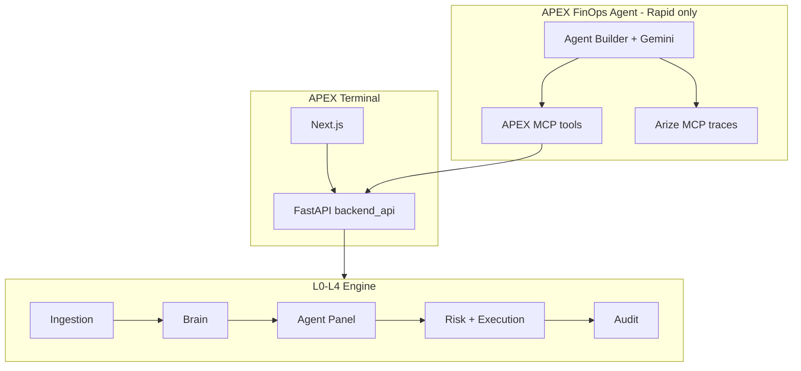

# APEX Hackathon Submissions

Dual entry from this repository:

| Event | Track | Entry | Deadline |
|-------|-------|-------|----------|
| [Beyond Tomorrow Summit](https://beyond-tomorrow-summit.devpost.com/) | FinTech + Cybersecurity | **APEX Terminal** — paper-only cross-market arb | Jun 5, 2026 |
| [Google Cloud Rapid Agent](https://rapid-agent.devpost.com/) | **Arize** | **APEX FinOps Agent** — Gemini + Agent Builder + MCP | Jun 11, 2026 |

## Problem

Prediction-market arbitrage is split across Kalshi and Polymarket. Retail and student builders lack institutional controls: executable edge (fees, liquidity), multi-agent governance, and a fail-closed risk stack before any order.

## Solution

1. **Arb Radar** — real-time Kalshi × Polymarket matching with net edge after fees.
2. **L2 multi-agent panel** — specialists, judge synthesis, adversarial Dexter-style checks.
3. **14-check risk gate** — paper-only enforcement (`R01` first), circuit breakers, append-only audit.

## 60-second judge demo (no API keys)

```bash
git clone https://github.com/aaravjj2/Autopilot-public.git
cd Autopilot-public
python -m venv .venv && source .venv/bin/activate
pip install -e ".[dev]"
export DEMO_MODE=true
python scripts/seed_demo.py
uvicorn backend_api:app --host 0.0.0.0 --port 8000 &
cd autopilot-local/frontend && npm install && DEMO_MODE=true npm run dev
```

Open **http://localhost:3000/dashboard/arb-radar** — seeded opportunities, thesis stream, paper trade (simulated).

## Hosted demo

Deploy the hackathon stack (see [scripts/deploy-hackathon-demo.sh](scripts/deploy-hackathon-demo.sh)):

```bash
export DEMO_MODE=true
export PUBLIC_DEMO_URL=https://your-host.example.com   # set after deploy
docker compose -f docker-compose.hackathon.yml up -d --build
```

Set `PUBLIC_DEMO_URL` in Devpost and README once live. Health: `GET /api/health` and `GET /api/demo/status`.

## Architecture



## Submission artifacts

| Artifact | Location |
|----------|----------|
| Beyond Tomorrow pitch outline | [docs/hackathon/beyond-tomorrow-pitch-deck.md](docs/hackathon/beyond-tomorrow-pitch-deck.md) |
| Beyond Tomorrow video script | [docs/hackathon/demo-video-script-beyond.md](docs/hackathon/demo-video-script-beyond.md) |
| AiForJob abstract | [docs/hackathon/AIFORJOB_SUBMISSION.md](docs/hackathon/AIFORJOB_SUBMISSION.md) |
| Rapid Agent missions | [agent/MISSIONS.md](agent/MISSIONS.md) |
| Rapid video script | [docs/hackathon/demo-video-script-rapid.md](docs/hackathon/demo-video-script-rapid.md) |
| Agent setup | [agent/README.md](agent/README.md) |

## Tech stack

Python 3.11+, FastAPI, Next.js, SQLite, Redis (optional), APScheduler. Agent layer: Google Cloud Agent Builder, Gemini 3, Arize MCP, custom APEX MCP server.

## License

Apache-2.0 — see [LICENSE](LICENSE).
