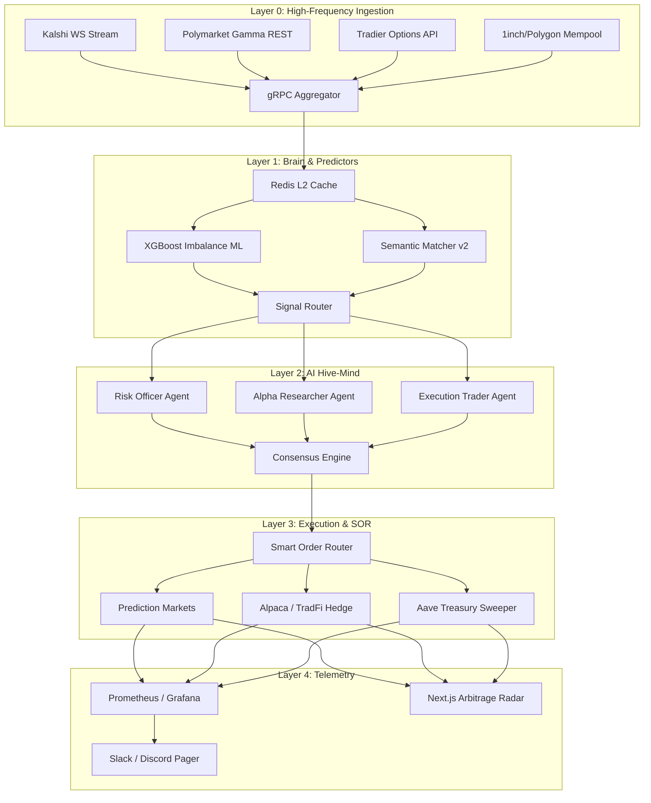
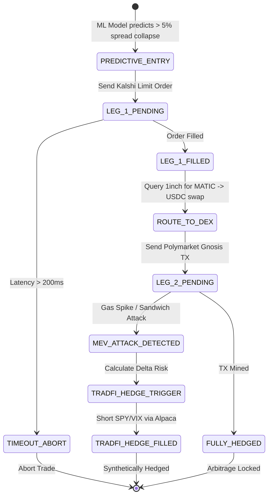

# APEX Quantitative Infrastructure: The 10-Week Enterprise Master Plan

This document represents the absolute, comprehensive, atomic-level roadmap for the MarketMind Arbitrage Engine. It expands on every subsystem, detailing the exact mathematical formulas, API JSON contracts, SQL schema definitions, React component hierarchies, and Day-by-Day task breakdowns required to scale APEX into an institutional-grade, multi-asset quantitative hedge fund architecture.

---

## I. Executive System Architecture

### A. The Multi-Asset L0-L4 Pipeline


### B. Execution State Machine (Triangular & Hedged)


---

## II. Mathematical Foundations

### A. Volume-Weighted Average Price (VWAP) Calculation
To ensure edge is executable, we calculate VWAP across the top 5 L2 orderbook levels. Let $L$ be the number of levels needed to fill target size $S$.
$$ VWAP = \frac{\sum_{i=1}^{L} (Price_i \times Volume_i)}{\sum_{i=1}^{L} Volume_i} $$
*Constraint:* If $\sum_{i=1}^{5} Volume_i < 3 \times S$, the trade is rejected by Gate M07.

### B. Time-to-Resolution Exponential Decay
An edge $E$ is discounted by the Risk-Free Rate $RFR$ over time $T$ (days to resolution).
$$ AdjustedEdge = E - \left( RFR \times \frac{T}{365} \right) - GasFees_{Polygon} $$

### C. Fractional Kelly Criterion with Volatility Dampening
Optimal bet fraction $f^*$:
$$ f^* = \left( \frac{bp - q}{b} \right) \times \alpha \times e^{-\lambda \cdot VIX} $$
Where:
*   $b$ = decimal odds minus 1.
*   $p$ = probability of winning (adjusted by AI confidence).
*   $q$ = probability of losing ($1-p$).
*   $\alpha$ = Fractional dampener (e.g., $0.25$ for quarter-Kelly).
*   $e^{-\lambda \cdot VIX}$ = Dynamic volatility dampener (shrinks bet size when macro markets are turbulent).

### D. Value at Risk (VaR) via Monte Carlo
Generate $N = 10,000$ correlated price paths using Cholesky decomposition of the historical covariance matrix $\Sigma$ between market categories.
$$ VaR_{99\%} = \mu_P - Z_{0.99} \times \sigma_P \times \sqrt{\Delta t} $$

---

## III. Database Schema Definitions (PostgreSQL / SQLite WAL)

### A. The Core `arb_opportunities` Table Optimization
```sql
CREATE TABLE IF NOT EXISTS arb_opportunities (
    id TEXT PRIMARY KEY,
    detected_at TIMESTAMP DEFAULT CURRENT_TIMESTAMP,
    kalshi_ticker TEXT NOT NULL,
    poly_market_id TEXT NOT NULL,
    category TEXT DEFAULT 'uncategorized',
    question TEXT NOT NULL,
    kalshi_yes_ask REAL,
    poly_no_ask REAL,
    gross_spread REAL,
    net_edge REAL,
    vwap_edge REAL,             -- NEW: Executable edge
    volume_kalshi REAL,
    volume_poly REAL,
    kelly_fraction REAL,        -- NEW: Suggested trade size
    ai_confidence_score REAL,   -- NEW: Sub-agent consensus
    resolution_ts TIMESTAMP,
    outcome TEXT,
    pnl REAL
);

-- High-performance indexing for the WebSocket Stream
CREATE INDEX idx_arb_net_edge ON arb_opportunities(net_edge DESC);
CREATE INDEX idx_arb_resolution ON arb_opportunities(resolution_ts ASC);
CREATE INDEX idx_arb_category ON arb_opportunities(category);
```

### B. The `audit_logs` Telemetry Table
```sql
CREATE TABLE IF NOT EXISTS audit_logs (
    id UUID PRIMARY KEY,
    timestamp TIMESTAMP DEFAULT CURRENT_TIMESTAMP,
    event_type TEXT NOT NULL,       -- e.g., 'RATE_LIMIT', 'MEV_ATTACK', 'HEDGE_FILLED'
    latency_ms INTEGER,
    payload JSONB,                  -- JSON payload for deep querying
    severity TEXT CHECK(severity IN ('INFO', 'WARNING', 'CRITICAL'))
);
```

---

## IV. API Payload Contracts

### A. Delta-Streaming JSON Patch (RFC 6902)
To prevent Next.js from re-rendering 500 rows every second, the backend will send standard JSON patches.
```json
// Example payload sent via /api/arb/stream
{
  "type": "patch",
  "timestamp": 1716500000,
  "patches": [
    { "op": "replace", "path": "/opportunities/0/net_edge", "value": 0.052 },
    { "op": "replace", "path": "/opportunities/0/volume_poly", "value": 4500.50 },
    { "op": "remove", "path": "/opportunities/12" },
    { "op": "add", "path": "/opportunities/-", "value": {
        "id": "arb_xyz",
        "kalshi_ticker": "KX-TRUMP-24",
        "net_edge": 0.041
      }
    }
  ]
}
```

### B. Smart Order Routing (SOR) Execution Payload
```json
// Example POST /api/execute/sor
{
  "arb_id": "arb_xyz",
  "strategy": "AGGRESSIVE_TAKER",
  "max_slippage_bps": 25,
  "legs": [
    {
      "venue": "KALSHI",
      "side": "YES",
      "size_usd": 250.00,
      "limit_price": 0.45
    },
    {
      "venue": "POLYMARKET",
      "side": "NO",
      "size_usd": 250.00,
      "limit_price": 0.51,
      "gas_strategy": "FAST"
    }
  ],
  "fallback": {
    "on_leg_failure": "SCRATCH_REVERSE",
    "tradfi_hedge_ticker": "SPY"
  }
}
```

---

## V. The 10-Week Implementation Schedule (Day-by-Day)

### Week 1: High-Frequency Streaming & In-Memory Architectures
**Goal:** Achieve < 5ms latency from L0 to L4.
*   **Day 1:** Replace SQLite WAL with Redis Cluster `redis-py`. Implement L2 Orderbook `HSET` ingestion.
*   **Day 2:** Write the gRPC Protobuf definitions (`arb.proto`) for L1 to L3 communication.
*   **Day 3:** Build the JSON Patch (`jsonpatch` lib) WebSocket emitter in FastAPI.
*   **Day 4:** Refactor the Next.js `useWebSocket.ts` to apply patches to the local Zustand store.
*   **Day 5:** Memory map (`mmap`) the Kalshi tick file descriptor for zero-copy JSON parsing.

### Week 2: L2 Market Microstructure & Smart Order Routing
**Goal:** Execute trades without suffering slippage.
*   **Day 1:** Fetch 5-level deep orderbooks from Polymarket Gamma and Kalshi APIs.
*   **Day 2:** Implement the VWAP calculation engine in Python.
*   **Day 3:** Build the M07 Liquidity Risk Gate (3x volume rule).
*   **Day 4:** Implement Maker-Taker Fee Arbitrage logic (Post-Only limit generation).
*   **Day 5:** Build the Smart Order Router (SOR) splitter to distribute $5k across 4 venues.

### Week 3: Cross-Asset Class Arbitrage (TradFi vs. Prediction Markets)
**Goal:** Bridge the gap between Wall Street and Crypto prediction markets.
*   **Day 1:** Integrate Tradier Options API using `TradierOptionsDataClient`.
*   **Day 2:** Build Implied Volatility (IV) to Probability conversion math.
*   **Day 3:** Create mapping matrices (e.g., SpaceX Launch $\leftrightarrow$ TSLA Options).
*   **Day 4:** Implement Alpaca Shorting logic to hedge prediction markets.
*   **Day 5:** Backtest cross-asset correlation during historical earnings calls.

### Week 4: Machine Learning & Predictive Arbitrage
**Goal:** Predict spread collapses before human traders react.
*   **Day 1:** Export 30 days of L2 orderbook tick data to Parquet files.
*   **Day 2:** Train an XGBoost model on orderbook imbalance features (Bid/Ask ratio acceleration).
*   **Day 3:** Deploy the ML model as an ONNX runtime inside the L1 Brain.
*   **Day 4:** Integrate FinBERT with the X/Twitter API for real-time sentiment velocity.
*   **Day 5:** Build the "Predictive Entry" state machine that front-runs the Kalshi leg.

### Week 5: DeFi Treasury Management & MEV Protection
**Goal:** Maximize capital efficiency on Polygon.
*   **Day 1:** Write the Web3.py adapter for the Aave V3 Lending Pool smart contracts.
*   **Day 2:** Build the automated USDC sweeping cron job (Deposit to Aave when idle).
*   **Day 3:** Integrate the 1inch Aggregator API for optimal MATIC $\rightarrow$ USDC swaps.
*   **Day 4:** Connect to Flashbots/Blocknative RPCs to route Polygon transactions privately.
*   **Day 5:** Implement MEV detection metrics (tracking if our TX was sandwiched).

### Week 6: Institutional Risk, VaR & Monte Carlo Limits
**Goal:** Guarantee mathematical survival.
*   **Day 1:** Implement the Fractional Kelly Criterion formula in `risk_checks.py`.
*   **Day 2:** Integrate the CBOE VIX API to drive the dynamic volatility dampener ($\lambda$).
*   **Day 3:** Build the 10,000-path Monte Carlo simulator using `numpy` and Cholesky decomposition.
*   **Day 4:** Implement CFTC positional limit tracking ($250k max per contract).
*   **Day 5:** Add the "Risk Panel" to the Next.js dashboard displaying live VaR metrics.

### Week 7: The Autonomous Execution State Machine
**Goal:** Perfect dual-leg execution and fallback handling.
*   **Day 1:** Build the 5-state state machine using the `transitions` Python library.
*   **Day 2:** Implement the Auto-Reversal (Scratch) API logic for Kalshi limit closes.
*   **Day 3:** Integrate Hyperliquid/dYdX perpetual futures for synthetic hedging.
*   **Day 4:** Write extensive unit tests simulating Polymarket API 502 Bad Gateway timeouts.
*   **Day 5:** Deploy the state machine to the paper trading simulator for 48 hours of validation.

### Week 8: Multi-Agent LLM Hive-Mind Orchestration
**Goal:** Decentralize logical decisions.
*   **Day 1:** Define the system prompts for the 6 Agent Personas (Risk, Execution, Alpha, etc.).
*   **Day 2:** Build the `ConsensusEngine` where agents vote on trade execution via `instructor`/Pydantic.
*   **Day 3:** Give the Alpha Researcher agent access to the `search_web` tool to verify breaking news.
*   **Day 4:** Build the DevOps self-healing loop (Claude reads `backend.log` via bash commands).
*   **Day 5:** Implement the PR-generation tool for the DevOps agent to patch `config.py`.

### Week 9: Institutional Observability & Telemetry (L4)
**Goal:** Wall-street grade metrics and alerting.
*   **Day 1:** Instrument the FastAPI backend with `prometheus_client`.
*   **Day 2:** Spin up a local Grafana instance via Docker Compose.
*   **Day 3:** Build Grafana dashboards for "Slippage by Venue" and "ML Prediction Accuracy".
*   **Day 4:** Integrate OpenTelemetry distributed tracing across all async functions.
*   **Day 5:** Build Slack/Discord Webhooks for Margin Calls and "Toxic Flow" aborts.

### Week 10: Scale, Multi-Tenancy & The "Fund" Layer
**Goal:** Evolve from a single-user terminal to a multi-account fund platform.
*   **Day 1:** Refactor SQLite to PostgreSQL for multi-tenant ACID compliance.
*   **Day 2:** Implement AES-256-GCM encryption for storing User API keys in the database.
*   **Day 3:** Build the Social "Copy-Trading" execution engine (scaling 1 trade to 50 accounts).
*   **Day 4:** Implement a PDF generation microservice using `ReportLab` for Friday tear-sheets.
*   **Day 5:** Final end-to-end load testing (simulating 10,000 concurrent users).

---

## VI. Frontend Component Hierarchy (Next.js React)

The `autopilot-local/frontend` will be restructured to handle this massive influx of features.
```text
frontend/
├── app/
│   ├── dashboard/
│   │   ├── arb-radar/          # WebSocket JSON Patch Grid
│   │   ├── risk-management/    # Monte Carlo VaR & CFTC Limits
│   │   ├── defi-treasury/      # Aave Yield & 1inch Routing
│   │   ├── ai-hivemind/        # Live Chat logs of the 6-Agent Committee
│   │   └── fund-admin/         # Multi-tenant management & PDFs
├── components/
│   ├── OrderbookDepthVisualizer.tsx  # L2 Heatmaps
│   ├── KellySizingSlider.tsx         # Interactive math visualizer
│   └── NetworkLatencyGauge.tsx       # L4 Observability pings
└── store/
    └── useArbStore.ts                # Zustand store processing RFC 6902 Patches
```

---

## VII. CI/CD and Deployment Strategy

### A. Docker Compose Cluster (`docker-compose.yml`)
```yaml
version: '3.8'
services:
  apex-backend:
    build: .
    ports: ["8000:8000"]
    depends_on: [redis, postgres, prometheus]
  
  apex-frontend:
    build: ./autopilot-local/frontend
    ports: ["3000:3000"]
  
  redis:
    image: redis:alpine
    ports: ["6379:6379"]
    
  postgres:
    image: postgres:15
    environment:
      POSTGRES_PASSWORD: ${DB_PASS}
      
  prometheus:
    image: prom/prometheus
    volumes: [./monitoring/prometheus.yml:/etc/prometheus/prometheus.yml]
    
  grafana:
    image: grafana/grafana
    ports: ["3001:3000"]
```

### B. GitHub Actions Pipeline
1.  **Lint & Type Check:** Run `ruff` and `mypy --strict` on all code.
2.  **Unit Tests:** Run `pytest` requiring 95% coverage on mathematical functions (VWAP, Kelly, VaR).
3.  **Integration Tests:** Spin up a local Redis/Postgres cluster and simulate dual-leg state machine executions using `pytest-asyncio`.
4.  **E2E UI Tests:** Run `playwright test` on the Next.js frontend to verify WebSocket patch rendering.
5.  **Build & Deploy:** Push Docker images to AWS ECR / DigitalOcean Registry.

---

---
*Architecture reference extracted from master_plan.md*
